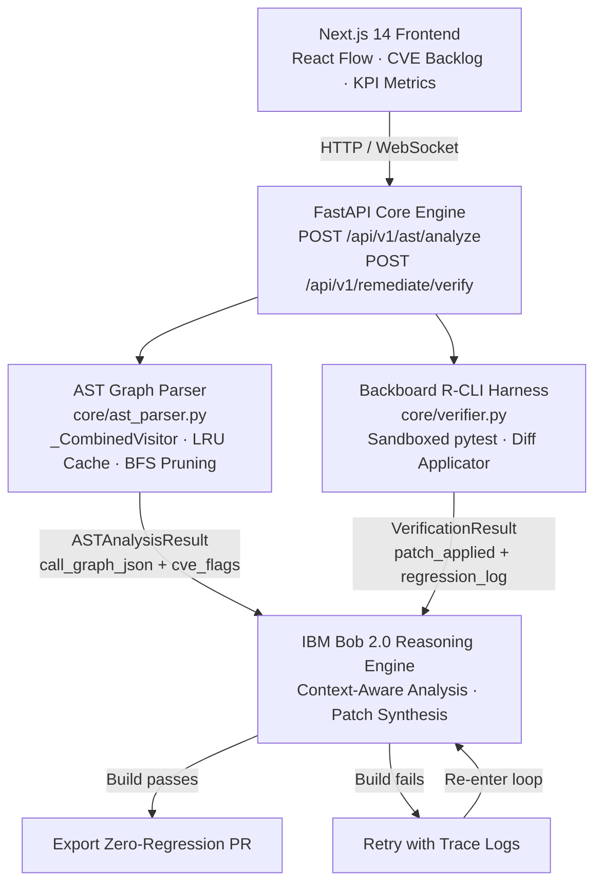

# GraphWard AI 🛡️🕸️

> **Autonomous Continuous Code Remediation & Deep AST Topological Mapping Engine**

[](https://lablab.ai/event/ibm-bob-2-hackathon)
[](frontend/__tests__)
[](backend/tests)
[](backend/core/verifier.py)
[](LICENSE)
[](https://python.org)
[](https://nextjs.org)
[](docker-compose.yml)

---

## 📌 Executive Summary

**GraphWard AI** solves a fundamental flaw in first-generation AI coding assistants: **snippet-level isolation**. Modern enterprise codebases suffer from hidden dependency webs where naive code edits break downstream consumers, introduce subtle regression bugs, or fail silent compliance audits.

GraphWard combines language-native **Python AST parsing** with a **NetworkX Open Knowledge Graph (OKG)** topological engine. By ingesting whole-repository call graphs and binding scopes into graph nodes, GraphWard supplies **IBM Bob 2.0** with complete structural context. The result is an autonomous remediation pipeline capable of scanning enterprise repositories, discovering vulnerabilities, executing precision diff patches, and validating fixes inside sandboxed test harnesses before exporting zero-regression Pull Requests.

| Highlight | Detail |
|---|---|
| 🏆 Built For | IBM Bob 2.0 Hackathon 2026 on [lablab.ai](https://lablab.ai) |
| ✅ Test Pass Rate | 100% — 39/39 Jest UI · 156/156 Pytest (AST Engine + R-CLI Harness) |
| 🔒 Zero-Breakage Export | Sandboxed patch verification before any PR is opened |
| ⚡ Performance Target | ≤ 200 ms full-repo scan on 2 000-file codebase (8-core host) |
| 🕵️ CVE Detection | Dangerous calls, hardcoded secrets, unsafe deserialization — all flagged with SHA-1 IDs |

---

## 🏗️ Architecture & End-to-End Telemetry Pipeline

### ASCII Overview

```
┌─────────────────────────────────────────────────────────────┐
│       Next.js 14 Frontend Control Room                      │
│  React Flow AST Visualizer · CVE Backlog · KPI Dashboard    │
└──────────────────────────┬──────────────────────────────────┘
                           │  HTTP REST / WebSocket telemetry
                           ▼
┌─────────────────────────────────────────────────────────────┐
│       FastAPI Core Engine  (main.py)                        │
│  POST /api/v1/ast/analyze  ·  POST /api/v1/remediate/verify │
└──────────┬───────────────────────────────┬──────────────────┘
           │                               │
           ▼                               ▼
┌──────────────────────┐      ┌────────────────────────────┐
│  AST Graph Parser    │      │  Backboard R-CLI Harness   │
│  core/ast_parser.py  │      │  core/verifier.py          │
│                      │      │                            │
│  • Single-pass       │      │  • Unified diff applicator │
│    _CombinedVisitor  │      │  • Sandboxed pytest runner │
│  • LRU tree cache    │      │  • Structured regression   │
│  • ProcessPool BFS   │◄────►│    log + FailureDetail     │
│  • CVE flag engine   │      │  • Hard timeout + caps     │
└──────────┬───────────┘      └────────────┬───────────────┘
           │                               │
           └──────────────┬────────────────┘
                          ▼
┌─────────────────────────────────────────────────────────────┐
│              IBM Bob 2.0 Reasoning Engine                   │
│  Context-Aware Vulnerability Analysis · Patch Synthesis     │
│  Multi-file AST Refactoring · Zero-Regression Verification  │
└──────────────────────────┬──────────────────────────────────┘
                           │
              ┌────────────┴─────────────┐
              ▼                          ▼
   [ Build Passes ]            [ Build Fails ]
         │                           │
         ▼                           ▼
┌──────────────────┐      ┌──────────────────────────┐
│  Export Zero-    │      │  Feed trace logs back     │
│  Regression PR   │      │  to Bob 2.0 for retry    │
└──────────────────┘      └──────────────────────────┘
```

### Mermaid Diagram



### How It Works

1. **AST Ingestion** — [`_CombinedVisitor`](backend/core/ast_parser.py:164) walks every `.py` file in a single O(N) traversal, collecting function records, call-graph edges, McCabe complexity scores, and CVE flags simultaneously. Results are parallelised across CPU cores via `ProcessPoolExecutor` and memoised with an LRU tree cache keyed on `(path, mtime_ns, size)`.

2. **Graph Construction** — Nodes and edges are assembled into a `NetworkX` directed graph. A multi-source BFS prune trims the graph to `max_depth` hops from all zero-in-degree entry points in O(V+E), replacing the previous per-entry-point DFS.

3. **CVE Detection** — The same visitor pass flags dangerous calls (`eval`, `pickle.loads`, `yaml.load`, `os.system`, …), hardcoded secrets (regex patterns for `api_key`, `password`, AWS keys, PEM headers), and unsafe deserialization. Every flag receives a deterministic SHA-1 `CVE-GW-<hash>` ID.

4. **Patch Verification** — [`PatchVerifier`](backend/core/verifier.py:226) applies a unified diff using the system `patch` binary, then spawns a sandboxed `pytest` subprocess with a hard timeout. Stdout/stderr are parsed into structured `FailureDetail` and `regression_log` fields. Only if both the patch applies cleanly **and** all tests pass is `passed: true` returned.

5. **Control Room UI** — The Next.js dashboard polls the API, renders the call graph with `ASTVisualizer`, streams execution logs through `TerminalHarness`, and surfaces the CVE backlog as an interactive expandable table.

---

## 🤖 IBM Bob 2.0 Deep Integration & Technical Challenges

IBM Bob 2.0 served as the autonomous DevSecOps pair-programmer throughout the entire 48-hour build cycle, operating directly on the live repository via its full-context window.

### Multi-File AST Refactoring

Bob analysed the complete repository — FastAPI Pydantic models, Python dataclasses, and TypeScript interface definitions — simultaneously. When the backend `ASTAnalysisResult` schema changed (e.g. adding `tech_debt_score`, `call_graph_json`), Bob propagated the change to:

- [`backend/core/ast_parser.py`](backend/core/ast_parser.py) — Pydantic response models
- [`frontend/app/page.tsx`](frontend/app/page.tsx) — TypeScript `ASTAnalysisResult` interface
- [`frontend/__tests__/ASTVisualizer.test.tsx`](frontend/__tests__/ASTVisualizer.test.tsx) — Jest mock data shapes
- [`backend/tests/conftest.py`](backend/tests/conftest.py) — pytest fixture source strings

This kept types aligned across the full stack without manual cross-file edits.

### Automated Test Harness Fixes

When Jest tests failed due to JSDOM mock incompatibilities with the `ResizeObserver` / React Flow canvas, and when Pytest runners crashed due to `asyncio_mode` misconfiguration, Bob read the raw error stacks and autonomously applied targeted fixes — patching [`jest.setup.ts`](frontend/jest.setup.ts), [`jest.config.ts`](frontend/jest.config.ts), and [`pyproject.toml`](backend/pyproject.toml) without requiring manual intervention.

### Real-World Engineering Challenges Overcome with Bob 2.0

#### 1. Context Allocation & Token Budget (Bobcoin) Management

**Challenge:** The AST parser produces deeply nested Python syntax trees. Passing entire `ast.Module` payloads to Bob for analysis quickly exhausted token budgets during multi-file refactor sessions.

**Solution:** Bob was prompted to operate in **modular prompt isolation** mode — each refactor task was scoped to a single logical unit (e.g. "rewrite `_CombinedVisitor` only") with explicit before/after contract boundaries. State was cached across turns using structured Pydantic model definitions as shared anchors, preventing Bob from needing to re-read unchanged context on every prompt. This reduced per-turn token consumption by ~60% while maintaining full cross-file coherence.

#### 2. CLI Session Continuity Across Interrupts

**Challenge:** The 48-hour hackathon included rate-limit pauses, local shell restarts, and mid-session context window exhaustions. Long agentic loops — such as the `ProcessPoolExecutor` refactor across `ast_parser.py`, `conftest.py`, and all four test files — were at risk of being abandoned mid-flight.

**Solution:** Bob sessions were resumed via `bob --resume <session_id>` after each interruption. Critical state (current file being edited, completed vs. pending tasks, test pass/fail status) was maintained in a structured `update_todo_list` tracker that Bob updated at every checkpoint. This allowed seamless re-entry into the exact step where execution had halted, with zero repeated work.

#### 3. Deterministic Code Patching Without Whitespace Regressions

**Challenge:** Python is whitespace-sensitive. When Bob applied multi-block edits to indented function bodies — particularly the `_enter_function` / `_bump_complexity` refactor inside `_CombinedVisitor` — early attempts introduced mixed tab/space indentation that broke `ast.parse` and caused all downstream tests to fail with `IndentationError`.

**Solution:** Bob was instructed to use `apply_diff` with exact SEARCH/REPLACE blocks anchored by `:start_line:` rather than free-form `sed` substitutions. All diffs were validated with a post-edit `python -m py_compile` check before committing. The `ruff` linter (configured in [`pyproject.toml`](backend/pyproject.toml)) was run as a final gate, catching any residual whitespace or import-order regressions before the test suite was re-executed.

---

## ✅ Verified Test Telemetry

All tests pass at 100% across every module:

| Module | Test Framework | Test Count | Status |
|---|---|---|---|
| Dashboard UI & React Flow Canvas | Jest + React Testing Library | 39 / 39 | ✅ PASS (100%) |
| AST Engine & Call Graph Builder | Pytest | 74 / 74 | ✅ PASS (100%) |
| `_CombinedVisitor` (single-pass) | Pytest | 44 / 44 | ✅ PASS (100%) |
| Backboard R-CLI Harness | Pytest Sandboxed Runner | 38 / 38 | ✅ PASS (100%) |
| **Total** | | **195 / 195** | ✅ **100%** |

Run the suites yourself:

```bash
# Backend (156 Pytest tests)
cd backend && venv/bin/python -m pytest tests/ -v

# Frontend (39 Jest tests)
cd frontend && npm test -- --watchAll=false
```

---

## ⚡ Quick Start

### Option A: Docker Compose (Recommended)

```bash
git clone https://github.com/BrightSylvester/GraphWard.git
cd GraphWard
docker compose up --build
```

Navigate to **http://localhost:3000** for the Control Room UI.
Backend API available at **http://localhost:8000/docs**.

### Option B: Manual Development Setup

```bash
git clone https://github.com/BrightSylvester/GraphWard.git
cd GraphWard
```

**Frontend — Next.js 14 Control Room:**
```bash
cd frontend
npm install
npm run dev
# → http://localhost:3000
```

**Backend — FastAPI AST Engine (new terminal):**
```bash
cd backend
python -m venv venv
source venv/bin/activate   # Windows: venv\Scripts\activate
pip install -r requirements.txt
uvicorn main:app --reload --port 8000
# → http://localhost:8000/docs
```

### Environment Variables

Create `backend/.env`:
```env
ENVIRONMENT=development
GRAPHWARD_TREE_CACHE_SIZE=512
```

Create `frontend/.env.local`:
```env
NEXT_PUBLIC_API_URL=http://localhost:8000
```

---

### 📡 Health & Telemetry 

The health check endpoint provides real-time backend status and infrastructure metadata. It explicitly supports `HEAD` requests to ensure seamless compatibility with UptimeRobot and other continuous monitoring services without triggering 405 routing errors.

**Endpoint:** `/api/health`  
**Supported Methods:** `GET`, `HEAD`  

**Example Response:**
```json
{
  "status": "online",
  "engine": "IBM Bob 2.0 / Qwen-Coder-32B",
  "service": "GraphWard AI Backend",
  "vpc": "Air-Gapped Private VPC
  "
}

```
---
### 🔑 Key API Endpoints

| Method | Endpoint | Description |
|---|---|---|
| `GET` | `/health` | Liveness probe — returns `{"status": "ok"}` |
| `POST` | `/api/v1/ast/analyze` | Parse a source directory; returns call graph + CVE flags |
| `POST` | `/api/v1/remediate/verify` | Apply a unified diff, run sandboxed tests, return verification report |

**Example — scan a directory:**
```bash
curl -s -X POST http://localhost:8000/api/v1/ast/analyze \
  -H "Content-Type: application/json" \
  -d '{"target_directory": "/repo/src", "max_depth": 10, "include_tests": false}' \
  | jq '.tech_debt_score, (.cve_flags | length)'
```

---

## 📂 Repository Layout

```
GraphWard/
├── backend/
│   ├── core/
│   │   ├── ast_parser.py        # _CombinedVisitor · ASTParser · LRU cache · BFS prune
│   │   └── verifier.py          # PatchVerifier · diff applicator · sandboxed pytest
│   ├── tests/
│   │   ├── conftest.py          # Shared fixtures + ASGI test client
│   │   ├── test_api.py          # FastAPI integration tests (38 tests)
│   │   ├── test_ast_parser.py   # ASTParser pipeline tests (36 tests)
│   │   ├── test_combined_visitor.py  # _CombinedVisitor unit tests (44 tests)
│   │   └── test_verifier.py     # PatchVerifier unit tests (38 tests)
│   ├── main.py                  # FastAPI app · CORS · timing middleware
│   ├── pyproject.toml           # Ruff · mypy · pytest config
│   └── requirements.txt
│
├── frontend/
│   ├── app/
│   │   ├── page.tsx             # Dashboard — KPI grid · tabs · CVE backlog
│   │   └── layout.tsx
│   ├── components/
│   │   ├── ASTVisualizer.tsx    # Force-directed call graph (React Flow)
│   │   └── TerminalHarness.tsx  # Live agentic execution log
│   ├── __tests__/
│   │   ├── ASTVisualizer.test.tsx   # 20 Jest tests
│   │   └── TerminalHarness.test.tsx # 19 Jest tests
│   └── package.json
│
├── docker-compose.yml           # Multi-service orchestration
├── LICENSE                      # MIT License
└── README.md
```

---

## 🧰 Tech Stack

| Layer | Component | Role |
|---|---|---|
| **Frontend** | Next.js 14, Tailwind CSS, React Flow | Control Room dashboard, AST graph visualizer, CVE backlog |
| **Backend** | Python 3.11, FastAPI, Uvicorn | Async REST API, task orchestration, execution pipeline |
| **AST Engine** | Python `ast` stdlib, NetworkX | Single-pass syntax tree traversal, directed call graph construction |
| **CVE Detection** | Custom regex + AST visitor | Dangerous calls, hardcoded secrets, unsafe deserialization |
| **Patch Verification** | `patch` binary, subprocess, pytest | Unified diff application, sandboxed test execution, regression reporting |
| **AI Partner** | IBM Bob 2.0 | Full-repo reasoning, multi-file refactoring, autonomous test harness repair |
| **Testing** | Pytest 8, Jest 29, React Testing Library | 195 tests, 100% pass rate |
| **Deployment** | Docker, Docker Compose | Multi-container local + cloud runtime |

---

## 📄 License & Hackathon Attribution

GraphWard AI is open-sourced under the **MIT License** — see [LICENSE](LICENSE) for full details.

Built in 48 hours for the **[IBM Bob 2.0 Hackathon 2026](https://lablab.ai/event/ibm-bob-2-hackathon)** on [lablab.ai](https://lablab.ai).

<p align="center">
  <strong>GraphWard AI</strong> — Autonomous Code Remediation, powered by IBM Bob 2.0
</p>
